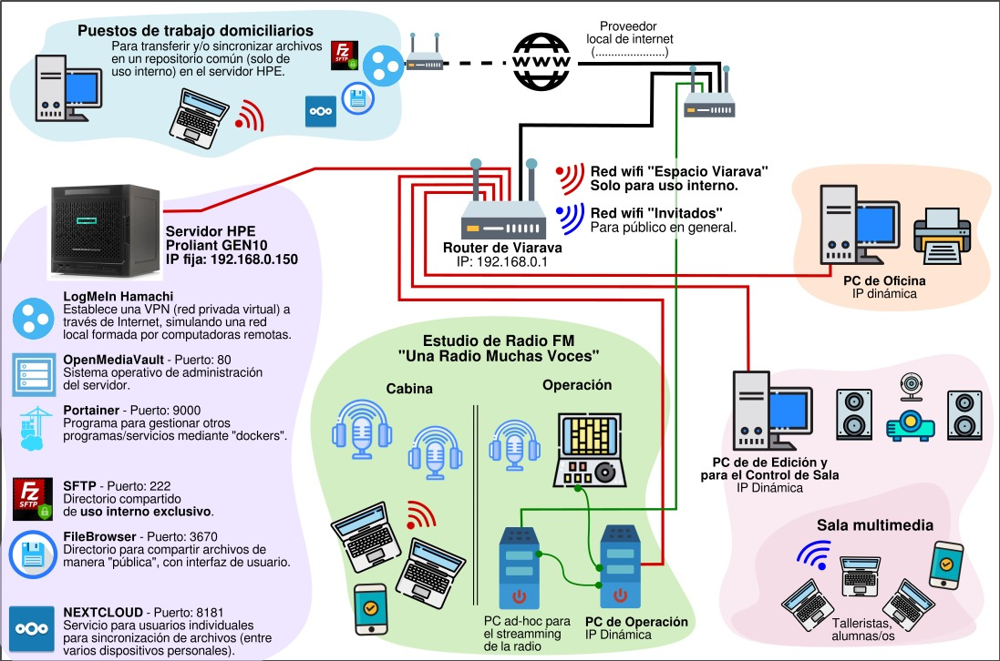

# Análisis de una infraestructura de red

## Integrantes

- [Bruno Guglielmotti](https://github.com/BrunoGugli)
- [Franco Rodriguez](https://github.com/rodriguezzfran)

## Desarrollo

A partir de la infraestructura de red de la empresa, se hizo un análisis identificando componentes críticos, elementos de protección
incorporados, elementos de protección que podrían incorporarse y si es viable o no.

Viendo: 

- La infraestructura de red y su arquitectura
- Los nodos y sus sistemas operativos
- Las aplicaciones instaladas y las posibilidades de asegurarlas

Se tuvieron en cuenta los siguientes criterios:

- ¿Que herramientas de autorización y autenticación se podrían implementar?
- ¿Que otras herramientas podrían agregarse para asegurar el sistema?
- ¿Que bugs o errores puede tener cada uno de estos dispositivos o aplicaciones? Ej. versiones de fw desactualizadas, versiones de aplicaciones desactualizadas ... etc.

#### Diagrama de la infraestructura

### Herramientas de Autenticación y Autorización

- __VPN__: Aunque LogMeIn Hamachi permite conexiones remotas seguras, es importante asegurarse de que la VPN esté configurada con autenticación robusta, cifrado fuerte y que se limite el acceso a usuarios autorizados. Por otro lado, ya que en el documento dice que desean más autonomía y flexibilidad con la VPN, se podría considerar [OpenVPN](https://openvpn.net/) o [WireGuard](https://www.wireguard.com/). Ambas son soluciones de código abierto que permiten gestionar una cantidad ilimitada de usuarios, y ofrecen cifrado fuerte y rendimiento eficiente. WireGuard, en particular, es más moderno, más rápido de configurar y tiene un muy buen perfil de seguridad.

- __OpenMediaVault (Puerto 80)__: El puerto 80 no es seguro ya que usa HTTP. Sería recomendable usar HTTPS (Puerto 443) para cifrar la transmisión de datos hacia/desde el servidor.

- __SFTP__ : Si bien, el uso de SFTP es una buena práctica para la transferencia segura de archivos, sería ideal limitar los accesos mediante reglas de firewall para evitar ataques por fuerza bruta.

- __Control de Acceso basado en Roles (RBAC)__: Para servicios como NextCloud o Portainer, se pueden implementar roles y permisos diferenciados para usuarios según sus funciones. Esto asegura que solo el personal autorizado tenga acceso a los recursos críticos de la red.

- __2FA__: esencial para proteger los accesos al servidor HPE y los servicios críticos como OMV, Portainer, NextCloud, y SFTP. Esto agregaría una capa adicional de seguridad en caso de que una contraseña sea comprometida.

- __LDAP o Active Directory (AD)__: Para gestionar usuarios de manera centralizada, se podría implementar un servidor [LDAP](https://www.redeszone.net/tutoriales/servidores/que-es-ldap-funcionamiento/) en el servidor HPE o integrar un servicio de [Active Directory](https://www.quest.com/mx-es/solutions/active-directory/what-is-active-directory.aspx). LDAP permitiría gestionar las credenciales de los usuarios en toda la red, asegurando que cada dispositivo y servicio (NextCloud, FileBrowser, SAMBA) esté sincronizado con un sistema central de autenticación.

### Herramientas de Seguridad Adicionales

- __Firewall y segmentación de red__: sería recomendable implementar reglas de firewall avanzado para bloquear puertos innecesarios y monitorear el tráfico. También configurar el firewall del router TP-Link TL-WR940N para limitar el acceso solo a los puertos necesarios (SFTP, OMV, FileBrowser, etc.).

- __IDS/IPS__: un sistema de detección y prevención de intrusiones (IDS/IPS) como [Suricata](https://suricata.io/) o [Snort](https://www.snort.org/) podría ser útil para monitorear el tráfico de red y detectar posibles amenazas.

- __Actualizaciones automáticas de software__: implementar actualizaciones automáticas tanto para OMV como para servicios críticos como NextCloud y Portainer. Mantener los sistemas actualizados es esencial para evitar vulnerabilidades conocidas. Las actualizaciones periódicas se pueden programar usando apt-get en Debian para OMV.

- __Backup Regular y Seguro__: Dado que se quiere agregar otro disco para backups, se debe asegurar de que las copias de seguridad sean incrementales y estén cifradas. OMV admite complementos para gestionar backups programados que también pueden replicarse a una ubicación externa.

### Posibles bugs, errores y vulnerabilidades

- __Firmware desactualizado en el router TP-Link TL-WR940N__: Los routers como el TL-WR940N suelen ser objetivos de ataques si no se actualizan regularmente. Se debería verificar seguido si existe una actualización de firmware disponible, ya que las versiones anteriores pueden tener vulnerabilidades críticas como exposición de puertos o fallos en la autenticación de WPA2.

- __Version de OMV, NextCloud y Portainer__: como la mayoría de aplicaciones de software, estas plataformas pueden tener vulnerabilidades conocidas. Lo ideal es mantenerlas siempre actualizadas y monitorear los boletines de seguridad para parches críticos. NextCloud ha tenido vulnerabilidades en versiones anteriores relacionadas con la autenticación y la exposición de archivos. Portainer en versiones antiguas ha sido objeto de vulnerabilidades como ataques de inyección de comandos.

- __LogMeIn Hamachi__: Aunque Hamachi ofrece cifrado y es una solución sencilla, no es la opción más escalable o segura para un número creciente de usuarios. Además, las cuentas gratuitas pueden ser más vulnerables a restricciones en la cantidad de conexiones o problemas de compatibilidad con actualizaciones futuras.

- __Servicios abiertos al exterior__:  Los puertos 9000 (Portainer), 80 (OMV), 8181 (NextCloud) y 22 (SFTP) pueden ser un punto de entrada si no están debidamente protegidos. Se deberían cerrar estos puertos para accesos externos, o al menos limitar el acceso mediante IPs confiables o VPN.
