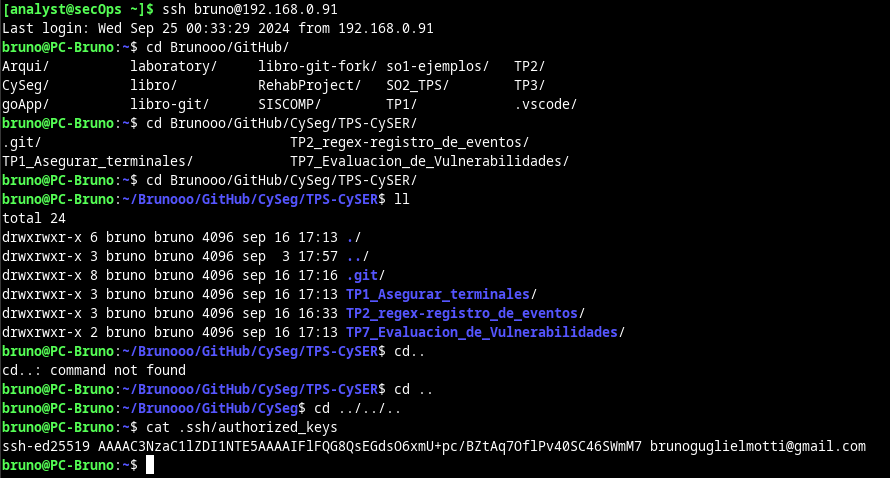
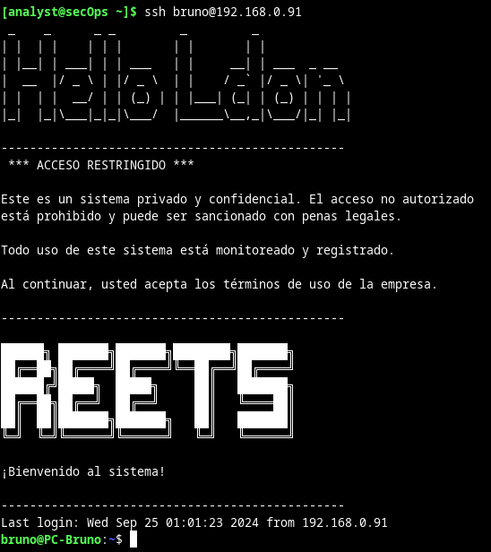

# Criptografía y seguridad en redes 
## Laboratorio 1.A

Creación de una clave SSH:


Con el comando cat vemos la clave pública:


En SSH se utilizan diferentes tipos de algoritmos:

- De intercambio de claves
- De cifrado
- De autenticación de claves públicas
- De integridad

#### Algoritmos de intercambio de claves

Se utilizan para negociar una clave de sesión compartida entre el cliente y el servidor.

- **Diffie-Hellman Group Exchange (DH-GEX)**: basado en el protocolo Diffie-Hellman.
- **ECDH** (Elliptic Curve Diffie-Hellman): basado en curvas elípticas, más eficiente que Diffie-Hellman tradicional.
- **Curve25519**: una curva elíptica de alto rendimiento y seguridad.

#### Algoritmos de cifrado

Como su nombre lo indica, se usan para cifrar datos transmitidos.

- **AES** (Advanced Encryption Standard) en modos CBC, CTR y GCM.
- **ChaCha20-Poly1305**: un cifrado basado en flujo junto con un MAC (Message Authentication Code).
- **3DES** (Triple Data Encryption Standard): más antiguo y considerado menos seguro, pero aún soportado.

#### Algoritmos de autenticación de claves públicas

Para autenticar al usuario mediante criptografía de clave pública (asimétrica).

- **RSA** (Rivest-Shamir-Adleman): aún está vigente, aunque se recomienda usar claves de al menos 2048 bits o superiores. Las claves RSA son las más utilizadas, pero el uso de claves más pequeñas (menos de 2048 bits) está desaconsejado.
- **DSA** (Digital Signature Algorithm): obsoleto y no recomendado debido a problemas de seguridad.
- **ECDSA** (Elliptic Curve Digital Signature Algorithm): más eficiente que RSA y DSA, basado en criptografía de curvas elípticas.
- **Ed25519**: basado en curvas elípticas, es moderno y ofrece alta seguridad y eficiencia.

#### Algoritmos de integridad (MAC)

Se utilizan para garantizar que los datos no han sido alterados durante la transmisión.

- **HMAC-SHA2**: basado en el algoritmo de hash SHA-2 (SHA-256, SHA-384, SHA-512).
- **HMAC-SHA1**: basado en SHA-1, aunque menos seguro que SHA-2.
- **UMAC**: ofrece mayor eficiencia para sistemas con alto rendimiento.


### Subir la clave pública ssh al servidor de entrada y al segundo servidor

- Verificación de la IP del segundo servidor:


La ip del segundo servidor es 192.168.0.91

- Generación de la clave ssh en el servidor de entrada (VM):


Hubo un problema al intentar copiar la clave pública al segundo servidor debido a que no se podía levantar el servicio ssh en la máquina virtual. Se solucionó con el siguiente comando:

```bash
[analyst@secOps ~]$ sudo -i
[root@secOps analyst] systemctl start sshd
[root@secOps analyst] exit
```

- Copia de la clave pública al segundo servidor:


- Prueba conexion al segundo servidor por ssh:



- Reinicio del servicio ssh:


- Agregado de un nuevo usuaruio en la PC local:


- Acceso desde la VM al nuevo usuario mediante ssh:


El mensaje "Warning: Permanently added ‘192.168.0.91’ (ED25519) to the list of known hosts", indica que la clave del host se ha agregado permanentemente a la lista de hosts conocidos en la máquina local.

- Configuración de un banner para quien se conecte por ssh:



## Laboratorio 1.B

SSH utiliza contraseñas para la autenticación de forma predeterminada y la mayoría de las
recomendaciones para proteger los servicios de SSH recomiendan usar claves
públicas/privadas. 

Una clave p/p sigue siendo solo un factor, aunque mucho más seguro. El terminal de su computadora enviará los datos a través de un túnel cifrado a
la máquina remota por lo que las posibilidades de ataque son ínfimas. Pero así como un pirata informático puede adivinar una contraseña con fuerza bruta, puede también robar una clave SSH y luego, en cualquier caso, con ese único dato, un atacante puede obtener
acceso a sus sistemas remotos. 

En este trabajo configuraremos la autenticación multifactor para combatir eso, habilitando la autenticación SSH utilizando una aplicación OATH-TOTP además de una clave SSH.


