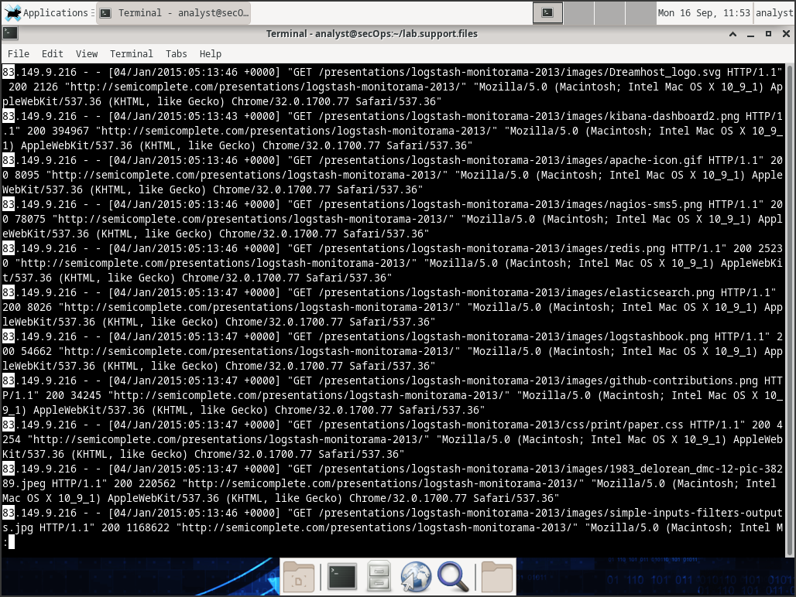
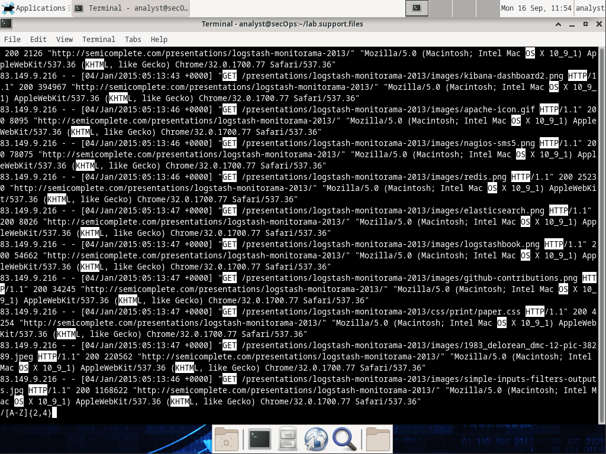
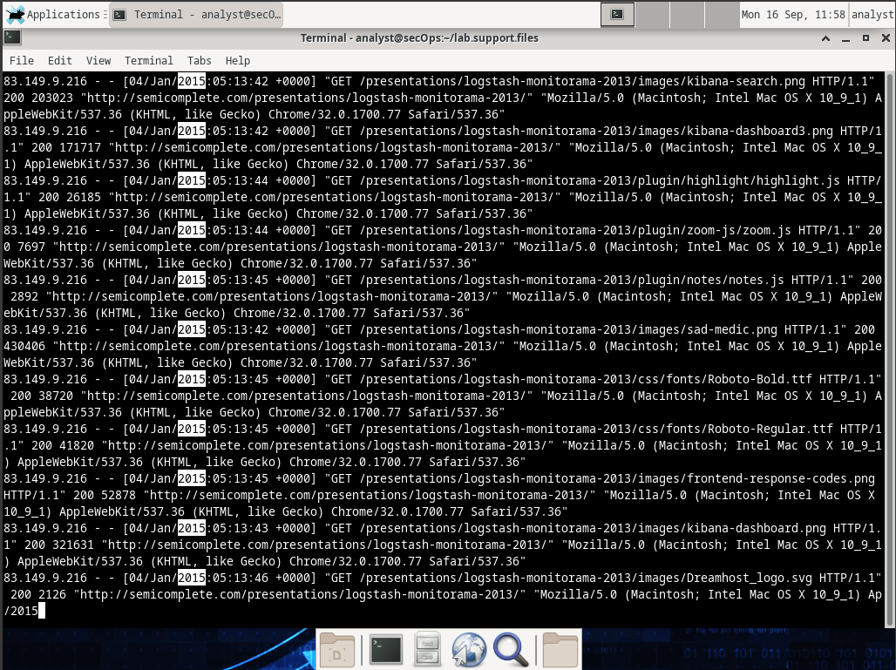
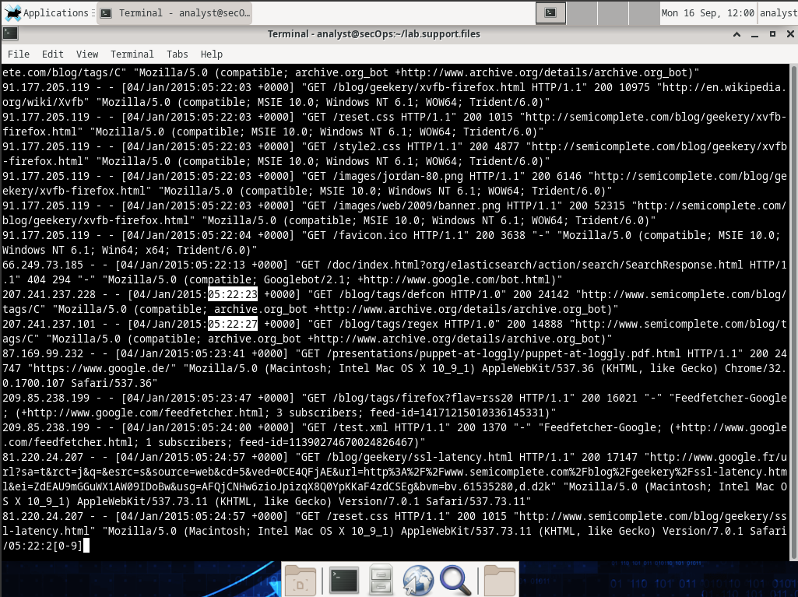
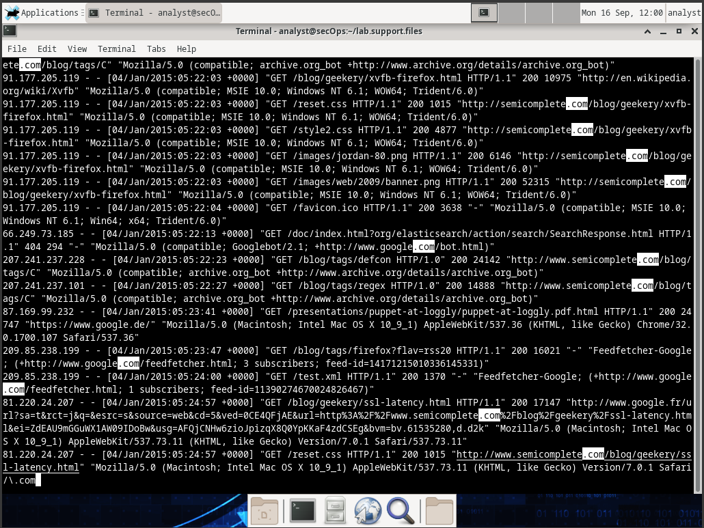
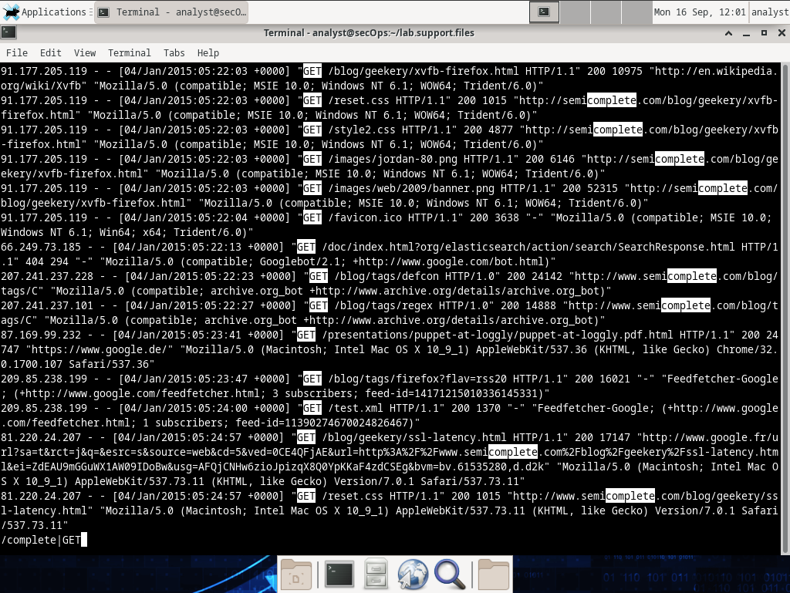
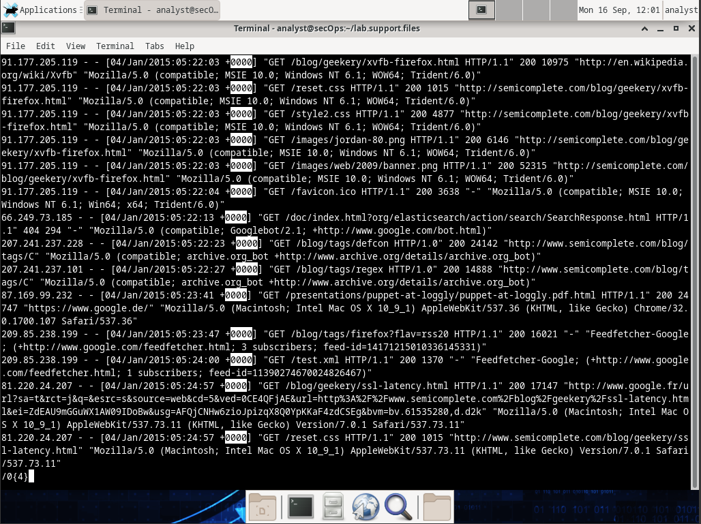

# Criptografía y seguridad en redes

### Laboratorio 2.A - Ejercicios de REGEX

*__Paso 1__*

Funciones de los metacaracteres

- \$ y ^ : '$' se usa para matchear una linea que termine con un set de caracteres específico, por ejemplo __successful$__ matcheará cualquier línea que termine con _"successful"_. '^' se usa para matchear una linea que comience con un set de caracteres específico, por ejemplo __^Mission__ matcheará cualquier línea que comience con _"Mission"_. Se usan en conjunto para detectar una linea entera. Por ejemplo para detectar la línea _"Mission: successful"_ se puede usar __^Mission: successful\$__

- \* : Para indicar cero o más repeticiones de un caracter o un set de caracteres.

- . : Para referirse a un caracter cualquiera.

- [] : Se pueden usar para matchear caracteres específicos, por ejemplo el patrón __[abc]__ solo matcheará una sola letra a, b o c. De la misma manera se pueden usar para excluir caracteres específicos usando el __'^'__ (hat), ej: __[^abc]__ matcheará cualquier caracter (uno solo) excepto una letra a,b o c. También puede usarse para matchear rangos de caracteres, como todos los caracteres entre el 0 y el 9 (__[0-9]__), todas las letras minusculas entre la A y la Z (__[a-z]__) y con la misma lógica y el __hat__ excluir rangos, por ejemplo excluir el rango entre la h y la m (__[^h-m]__).

- \\. : Como el punto (.) está reservado para matchear cualquier caracter, para matchear un punto literalmente en la expresión, se usa "\\."

- \\d : Para matchear cualquier caracter que sea un dígito.

- \\D : Para matchear cualquier caracter que no sea un dígito.

- {m} y {m,n} : Se refiere a la capacidad para detectar una cantidad m de repeticiones de un determinado caracter. Por ejemplo __a{3}__ matcheará la letra 'a' 3 veces. También se puede especificar un rango de repeticiones, por ejemplo __a{1,8}__ matcheará el caracter no más de 8 veces y no menos de 1. Este cuantificador se puede utilizar con cualquier carácter o metacaracteres especiales, por ejemplo __w{3}__ (tres w), __[wxy]{5}__ (cinco caracteres, cada uno de los cuales puede ser una w, una x o una y) y __.{2,6}__ (entre dos y seis de cualquier carácter).

- abc|123 : OR lógico, también conocido como pipe, sirve para indicar diferentes conjuntos posibles de caracteres. Puedo escribir el patrón "__Comprar más (leche|pan|jugo)__" para que coincida únicamente con las cadenas "Comprar más leche", "Comprar más pan" o "Comprar más jugo".


*__Paso 2__*

Algunos patrones de expresiones regulares:

- __^83__ : Matcheará cualquier linea que comience con la palabra "83".

- __[A-Z]{2,4}__ : Matcheará entre 2 y 4 caracteres, los cuales pueden ser cualquier letra mayúscula entre la A y la Z.

- __2015__ : simplemente matcheará la palabra "2015".

- __05:22:2[0-9]__ : matcheará cualquier hora entre las 05:22:20 y las 05:22:29.

- __\\.com__ : matcheará cualquier línea que posea la palabra ".com" en ella.

- __complete|GET__ : matcheará cualquier línea que posea la palabra "complete" o "GET".

- __0{4}__ : matcheará el caracter '0' hasta 4 veces.

*__Paso 3__*

Aplicando las regex anteriores en la VM de Workstation:

- __^83__ :



- __[A-Z]{2,4}__ : 



- __2015__ :



- __05:22:2[0-9]__ :



- __\\.com__ :



- __complete|GET__ :



- __0{4}__ :



### Laboratorio 2.B - Registro de eventos

¿Que es un *__registro de eventos__*? Los archivos de registro, son archivos que las computadoras utilizan para registrar eventos. Los programas
de software, los procesos en segundo plano, los servicios o las transacciones entre servicios (incluido el propio sistema) pueden generar tales eventos. Los archivos de registro dependen de la aplicación que los
genera. Cumplir con la convención de los archivos de registro es responsabilidad del desarrollador de la aplicación. La documentación del software debe incluir información sobre sus archivos de registro.

### Parte 1: Descripción general de los archivos de registro

*__Paso 1__*

En este paso se nos pide analizar el siguiente registro de evento:

```bash
[Wed Mar 22 11:23:12.207022 2017] [core:error] [pid 3548:tid 4682351596] [client
209.165.200.230] File does not exist: /var/www/apache/htdocs/favicon.ico
```

Mucha información se puede obtener del análisis del registro, en este caso está diciendo que el servir  *__Apche__* no pudo encontrar el archivo `favicon.ico` en la ruta `/var/www/apache/htdocs` en la solicitud hecha por el usuario con la ip `209.165.200.230`

Luego se usa el comando `cat /var/log/logstash-tutorial.log` que muestra la siguiente salida 

```Bash
83.149.9.216 - - [04/Jan/2015:05:13:42 +0000] "GET
/presentations/logstash-monitorama-2013/images/kibana-search.png HTTP/1.1" 200 203023
"http://semicomplete.com/presentations/logstash-monitorama-2013/" "Mozilla/5.0
(Macintosh; Intel Mac OS X 10_9_1) AppleWebKit/537.36 (KHTML, like Gecko)
Chrome/32.0.1700.77 Safari/537.36"
83.149.9.216 - - [04/Jan/2015:05:13:42 +0000] "GET
/presentations/logstash-monitorama-2013/images/kibana-dashboard3.png HTTP/1.1" 200
171717 "http://semicomplete.com/presentations/logstash-monitorama-2013/" "Mozilla/5.0
(Macintosh; Intel Mac OS X 10_9_1) AppleWebKit/537.36 (KHTML, like Gecko)
Chrome/32.0.1700.77 Safari/537.36"
83.149.9.216 - - [04/Jan/2015:05:13:44 +0000] "GET
/presentations/logstash-monitorama-2013/plugin/highlight/highlight.js HTTP/1.1" 200
26185 "http://semicomplete.com/presentations/logstash-monitorama-2013/" "Mozilla/5.0
(Macintosh; Intel Mac OS X 10_9_1) AppleWebKit/537.36 (KHTML, like Gecko)
Chrome/32.0.1700.77 Safari/537.36”
```
La salida está omitida para que no sea larga pero la podemos considerar una transacción web debido a que todas son solicitudes HTTP realizadas por un cliente web (Mozilla) que solicita un recurso como un archivo o una imágen, vemos el estado de la solicitud hecha y el tipo, así como también la marca de tiempo y la ip.

Es diferente porque el primero es un registro de error que se usan para diagnosticar problemas, mientras que el segundo es un registro de acceso que se usa para monitorear el tráfico web y el comportamientos de los usuarios. La información es diferente porque los propósitos son diferentes.

*__Paso 2__*

Ahora pasaremos a analizar los registros del sistema operativo, los cuales se encuentran en la ruta `/var/log/messages` al ejecutarlo la salida es similar a la siguiente


Allí podemos ver todos los registros de eventos del sistema operativo, incluidos aquellos que mencionan el por que la red estaba inestable y lenta por ese tiempo, resulta que la interfaz *__enp0s3__* estaba sufriendo conexiones y desconexiones constantes, por lo que es un primer acercamiento a sobre como encarar la solución.

### Parte 2: Ubicar archivos de registro en sistemas desconocidos

La VM CyberOps Workstation incluye nginx, un servidor web liviano. En esta sección veremos cómo encontrar y exhibir archivos de registro de nginx utilizando la VM CyberOps Workstation.

Lo primero que tendremos que hacer es verificar que *__nginx__* se está ejecutando en la vm con el siguiente comando `ps ax | grep nginx`


en nuestro caso no se estaba ejecutando, así que con el comando `sudo /usr/sbin/nginx` lo ponemos a correr

Ahora resulta que el manual de nginx no daba información sobre dónde estaban los archivos de registro, así que toca buscarlo, para ello primero usaremos `ls /etc/` para ver si hay alguno.


Luego de usar el comando vemos que efectivamente si hay una carpeta que hace mención a *__nginx__* y al entrar vemos el archivo `nginx.conf`, si usamos cat para verlo vemos lo siguiente.


No hay mención a los archivos de registro. Seguimos la investigación en `/var/log/` 


Como vemos, en la carpeta correspondiendte a *__nginx__* dentro de log hay una serie de archivos que sugieren que se está usando la configuración por defecto y que esos quizás sean los archivos de registro que estamos buscando.

### Parte 3: Monitorear archivos de registro en tiempo real

Esta práctica de laboratorio se enfoca en tail,
una herramienta simple pero eficiente que está disponible prácticamente en todos los sistemas basados en
Unix. La idea con esto es poder ver las actualizaciones de los registros en tiempo real.

Si usamos el comando `sudo tail -f /var/log/nginx/access.log` con el `-f` abreviatura de "follow" podemos ver sus actualizaciones en tiempo real


como vemos está vacio, pero si vamos a la dirección `127.0.0.1` usando el navegador


 


