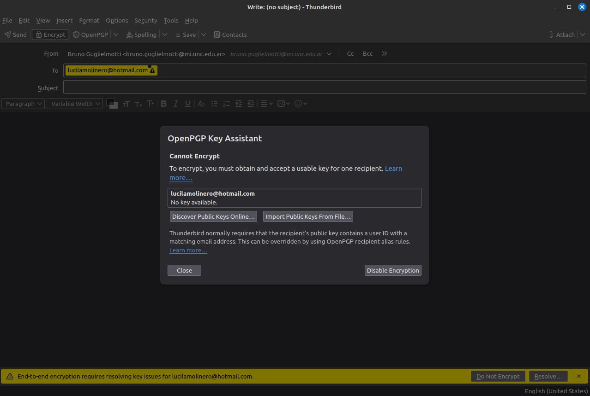

# Firma digital de correos electrónicos

## Integrantes

- [Bruno Guglielmotti](https://github.com/BrunoGugli)
- [Franco Rodriguez](https://github.com/rodriguezzfran)

### Firma de correo con clave autogenerada

- Configuración de Thunderbird

- Generación de claves

Una vez generada, se puede ver listada:

- Exportar clave pública

Para publicar la clave pública, se puede exportar a un archivo de texto y luego subir este a un servidor de claves públicas como [keys.openpgp.org](https://keys.openpgp.org/). Para esto hacemos click derecho sobre la key a exportar en el OpenPGP Key Manager y seleccionamos `Export Public Key(s) To File`; finalmente entramos a la página web y subimos el archivo.

Luego de verificar el correo, la clave pública queda publicada:

- Configurar Thunderbird para firmar correos:

Yendo a la seccion *"End-To-End Encryption"* de los ajustes de cuenta se debe seleccionar la clave privada que se generó anteriormente (si se generaron varias, se puede seleccionar la que se desee).

En esta parte se puede ver que Thunderbird provee la opcion de subir la clave publica a un servidor de claves publicas ([keys.openpgp.org](https://keys.openpgp.org/)) presionando en el botón *Publish*, pero como ya se hizo anteriormente, no es necesario.

- Envío de mail

Una vez configurado, escribimos un correo, seleccionamos Encrypt y OpenPGP para firmarlo y lo enviamos.

Aquí se aprecia que no hay inconvenientes ya que el destinatario en este caso es otra cuenta configurada en Thunderbird la cual cuenta con una clave pública asociada.

Si queremos enviar a un destinatario del cual no contamos con su clave pública, Thunderbird nos avisará de esto y nos dará la opción de enviarlo sin firmar o de resolver el miss de la clave ya sea buscando claves públicas en línea o importando una clave manualmente:

En este caso, el mail del ejemplo no tiene clave publicada.

En este caso el mail del ejemplo sí tiene clave publicada, entonces al presionar en *Discover Public Keys Online*, Thunderbird la encuentra y muestra el ID de la clave asociada a ese e-mail. Entonces ahora basta con seleccionarla y presionar en *Accept* para poder enviar el mail firmado y encriptado; además, la clave pública del destinatario se guardará en el OpenPGP Key Manager.

- Recepción de mail

Cuando recibimos un mail firmado y encriptado, Thunderbird nos mostrará un candado cerrado en la parte superior derecha del mail, indicando justamente esta condición del mail.

Si queremos ver el mail recibido desde el cliente de correo web, en este caso Gmail, no se puede ver el contenido del mail; solo se puede ver un archivo adjunto que contiene la clave pública del remitente.

### Firma digital con certificado provisto por terceros

- Solicitud del certificado en [Actalis](https://extrassl.actalis.it/portal/uapub/doSendEmail)

- Certificado recibido

- Importar certificado

Una vez descargado el certificado, lo agregamos en el *Certificate Manager* en la pestaña *Your Certificates*. Después de agregarlo vemos que aparece listado:

- Configurar el certificado para la firma de correos

Nuevamente en la sección de End-To-End Encryption de los ajustes de cuenta, en la parte de S/MIME agregamos el certificado en *Personal certificate for digital signing*. Además podemos seleccional si queremos que por defecto se firmen los mensajes no encriptados.

- Envío de mail

Como vemos, hay que seleccionar S/MIME en vez de OpenPGP para firmar el correo con el certificado, además en ese apartado o en *Security* activar la opción *Digitally Sign*

- Recepción de mail

En este caso, el mail recibido tiene la firma digital verificada, y si apretamos en *Información dedl remitente* podemos ver quien emitió el certificado.

