# Wordpress

## Integrantes

- [Bruno Guglielmotti](https://github.com/BrunoGugli)
- [Franco Rodriguez](https://github.com/rodriguezzfran)

## Introducción

#### ¿Qué es Wordpress?

WordPress es un sistema de gestión de contenido (CMS) de código abierto que permite a los usuarios crear y administrar sitios web y blogs de manera sencilla. WordPress es conocido por su flexibilidad, personalización a través de temas y plugins, y una comunidad activa que contribuye constantemente a su desarrollo.

#### ¿Quiénes usan Wordpress?

WordPress es utilizado por una amplia variedad de usuarios, incluyendo:

- __Blogueros__: Personas que desean compartir sus pensamientos, experiencias o conocimientos.

- __Pequeñas y medianas empresas__: Para crear presencia en línea y promocionar sus productos o servicios.

- __Grandes corporaciones__: Muchas marcas reconocidas utilizan WordPress para sus sitios web debido a su escalabilidad y flexibilidad.

- __Organizaciones sin fines de lucro__: Para difundir información y recaudar fondos.

- __Desarrolladores__: Que crean temas y plugins personalizados para satisfacer necesidades específicas.

#### ¿Donde puedo encontrar una lista de vulnerabilidades de wordpress y sus pluggines?

Se puede encontrar una lista de vulnerabilidades de WordPress y sus plugins en varias fuentes, algunas de estas son:

- __CVE Details__: Esta página proporciona un listado detallado de vulnerabilidades conocidas en WordPress y sus plugins, incluyendo información sobre la gravedad y las versiones afectadas.

- __Revista Ciberseguridad__: Este sitio ofrece un análisis sobre las vulnerabilidades más comunes en plugins y temas de WordPress, destacando la importancia de mantener el software actualizado para evitar ataques. Aunque no es una lista exhaustiva, proporciona información valiosa sobre los riesgos asociados.

- __Blog BAEHOST__: Aquí se puede encontrar un resumen de los plugins más vulnerables de WordPress, con descripciones sobre las vulnerabilidades específicas que presentan. Esta fuente es útil para conocer los plugins que se deben vigilar o evitar.

- __Hostinet__: En [este articulo](https://www.hostinet.com/formacion/wordpress/dentificar-plugins-vulnerables-desactualizados/) se muestran cuatro plugins útiles para identificar plugins vulnerables o desactualizados en WordPress.


## Práctica

### Instalación de LAMP (Linux, Apache, MySQL, PHP)

Primero asegurarse de que el sistema está actualizado:

```bash
sudo apt update && sudo apt dist-upgrade -y
```

Ahora para instalar el paquete se puede usar este comando:

```bash
sudo apt install lamp-server^ -y
```

En nuestro caso no funcionó ya que encontraba errores de dependencias con MySQL, para solucionarlo
primero se removieron los paquetes de MySQL que generan conflicto:

```bash
sudo apt remove --purge mysql-server mysql-client mysql-common
sudo apt autoremove
sudo apt clean
```

Luego se instaló MySQL de forma manual:

```bash
sudo apt install mysql-server
```

Finalmente PHP y Apache fueron instalados manualmente también:

```bash
sudo apt install apache2 php libapache2-mod-php php-mysql
```

Para verificar la instalación:

```bash
sudo systemctl status apache2
sudo systemctl status mysql
php --version
```


### Instalación de Wordpress

Primero se descargó desde su sitio oficial:

```bash
wget https://wordpress.org/latest.tar.gz
tar -xvzf latest.tar.gz
```

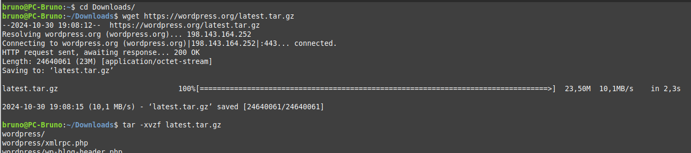


Luego se debe mover wordpress al directorio web:

```bash
sudo mv wordpress/* /var/www/html/
```

Lo siguiente es configurar los permisos de Apache para que tenga acceso a los
archivos de Wordpress:

```bash
sudo chown -R www-data:www-data /var/www/html/
sudo chmod -R 755 /var/www/html/
```

Ahora se debe crear la base de datos y el usuario para Wordpress:

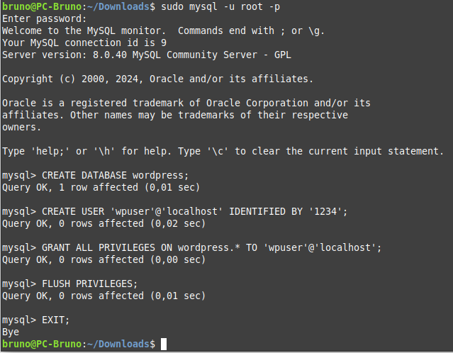

Ahora configuramos wordpress:

```bash
cd /var/www/html/
sudo cp wp-config-sample.php wp-config.php
sudo nano wp-config.php
```

Y modificamos las lineas correspondientes a la base de datos:

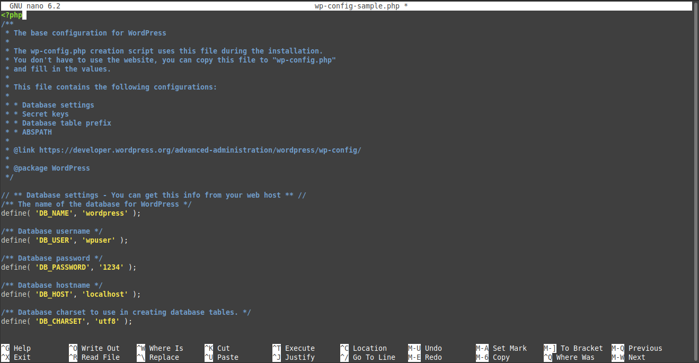

Luego se accede a http://localhost para verificar que todo funcione y debería aparecer
un banner de Apache que dice _"It works!"_.

Luego para completar la instalación se debe eliminar el archivo _index.html_ que se encuentra
en _/var/www/html/_, acceder a http://localhost/wp-admin/install.php. y allí seguir los pasos.

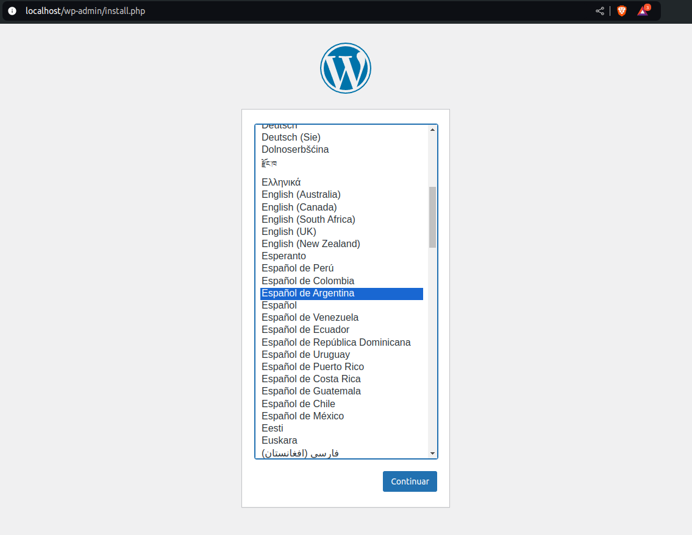

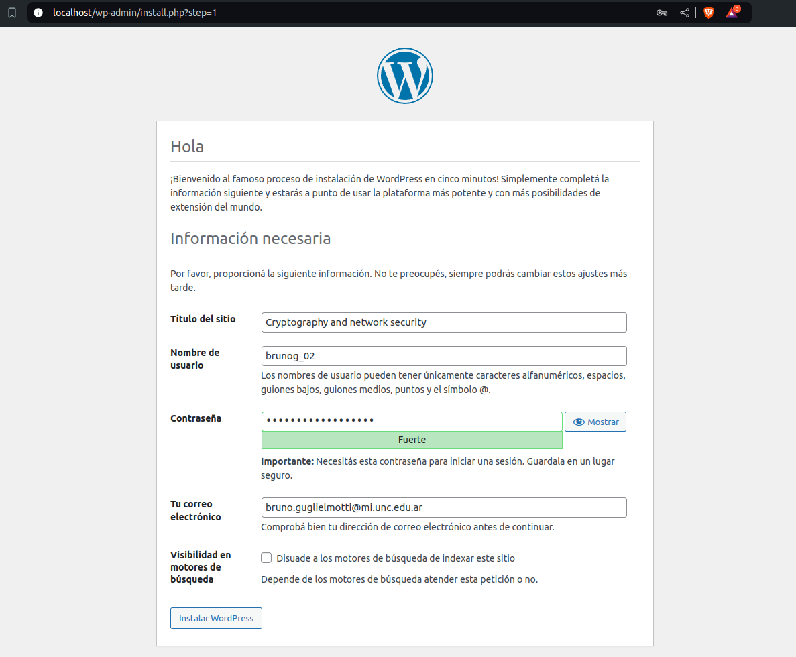

Y finalmente asi se ve el dashboard:

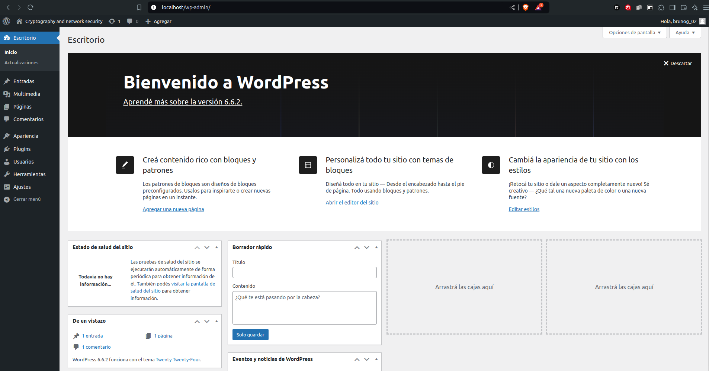

Ahora instalamos el plugin _Wordfence Security_ para proteger nuestro sitio:

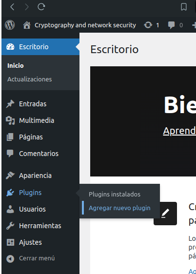

Buscamos Wordfence Security y lo instalamos:

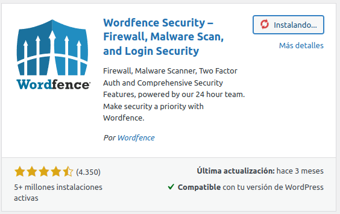

Luego hay que presionar en _Activate_ para activar el plugin y seguir todos los paseso que se indican.

Una vez instalado e iniciado aparece a la izquierda.

Sobre el firewall de Wordfence:

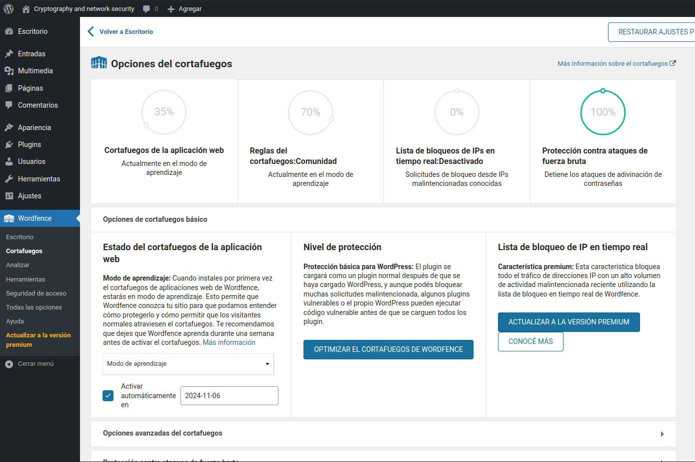

A la izquierda se puede ver que dice que esta en modo aprendizaje, esto permite que Wordfence conozca nuestro sitio para que pueda entender cómo protegerlo y cómo permitir que los visitantes normales atraviesen el firewall.

El firewall se puede optimizar para mejorar el nivel de protección y así
todas las solicitudes PHP serán procesadas por el firewall antes de su ejecución. Entonces seleccionamos _Optimizar el cortafuegos de wordfence_

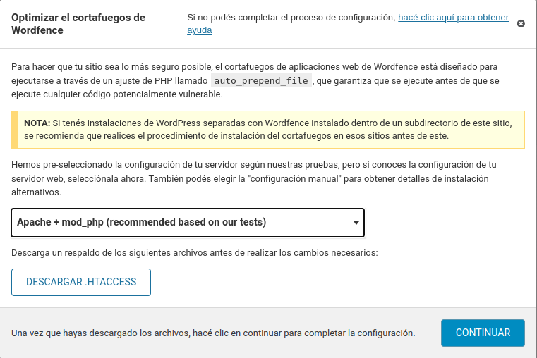

En opciones avanzadas podemos configurar distintos aspectos del firewall como:

- Una lista de direcciones IP permitidas que puedan eludir todas las reglas.

- Elegir cuales servicios están permitidos.

- Bloquear IPs que intenten repetidamente a ciertas URL de nuestro sitio web.

- Especificar direcciones IP para ser ignoradas para las alertas del firewall de aplicaciones web de Wordfence.

- Activar y desactivar reglas segun preferimos.

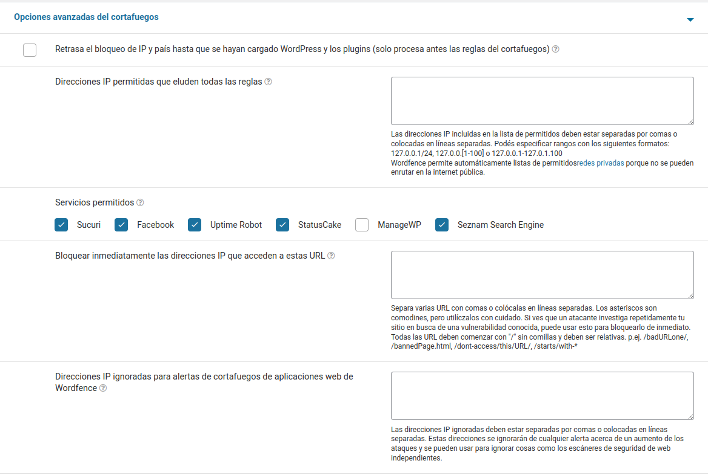

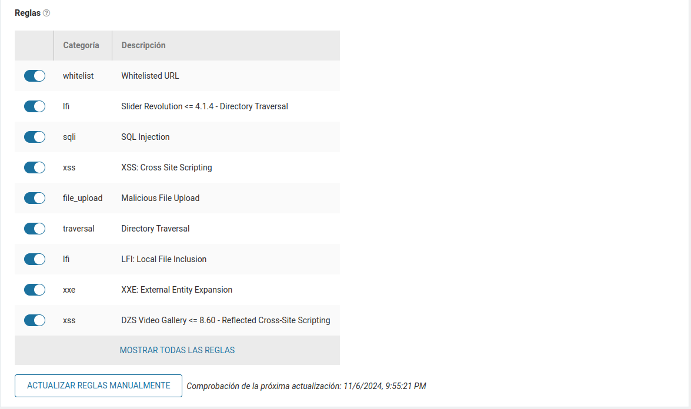

Otro aspecto muy interesante que tiene  Wordfence es que da opciones de configuracion para los ataques de fuerza bruta:

- Maximo de intentos fallidos de inicio de sesion permitidos por IP antes de bloquear.

- Maximo de intentos de contraseña olvidada permitidos por IP antes de bloquear.

- Durante cuanto tiempo cuenta estos fallos.

- Cantidad de tiempo que se bloquea a un usuario.

- Elegir nombres de usuarios los cuales si intentan ingresar seran bloqueados de IP.

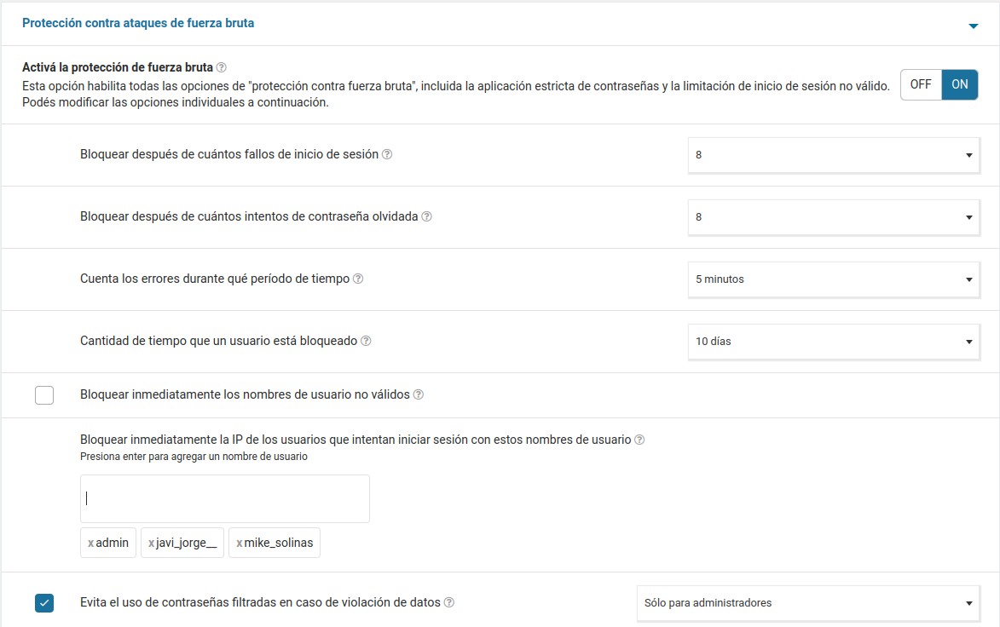

Además ofrece otras opciones adicionales:

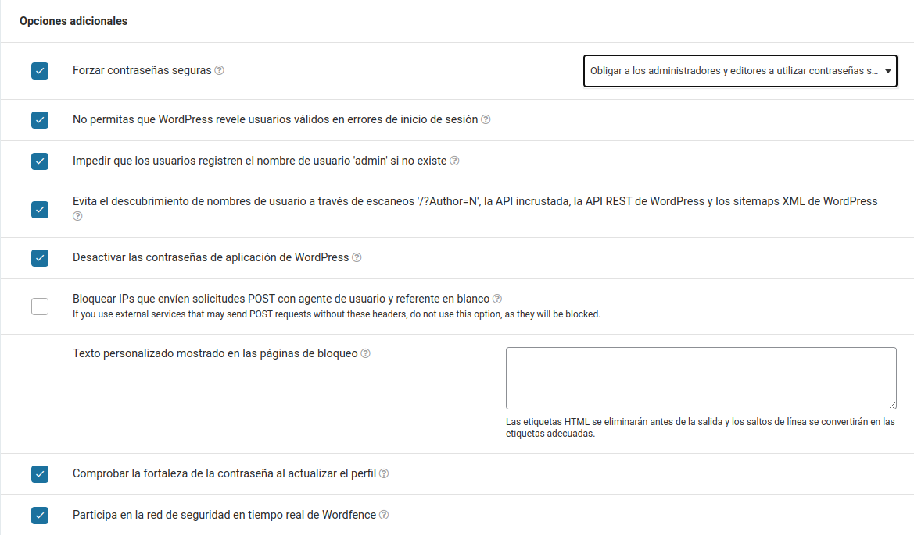

Otro punto para configurar es el Límite de puntuación de bloqueo de IP, que es la cantidad de puntos que un visitante puede acumular antes de ser bloqueado.

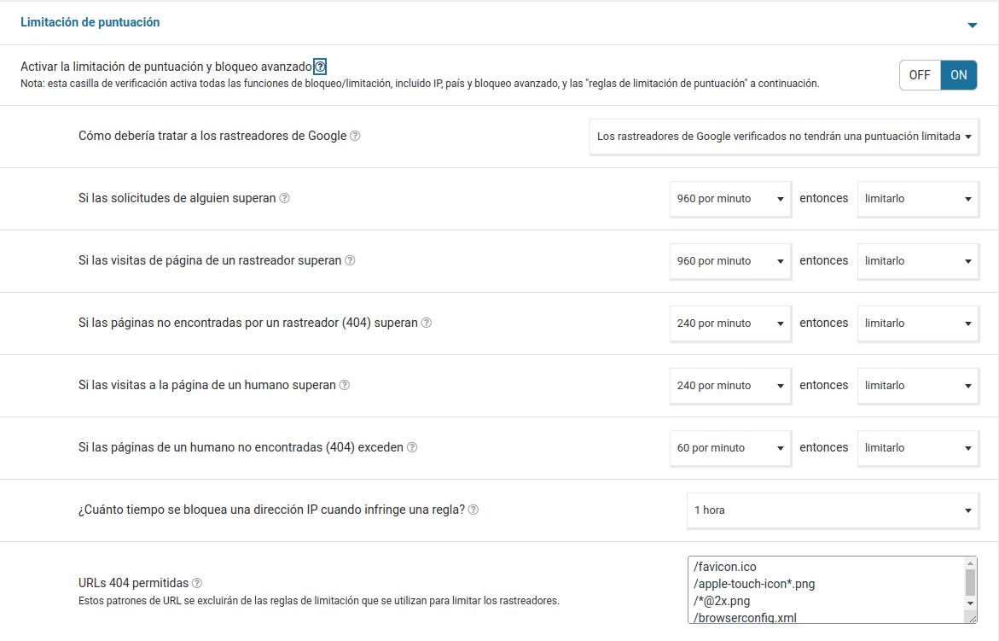

Y finalmente otra opción del Firewall son las URL permitidas, las cuales se agregarán a una whitelist y no serán bloqueadas por el firewall si dan falsos positivos.

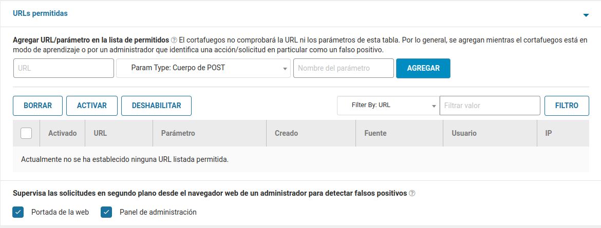

Luego en _Todas las opciones_ se configuró Wordfence de la siguiente manera (lo que no se muestra se dejo default):

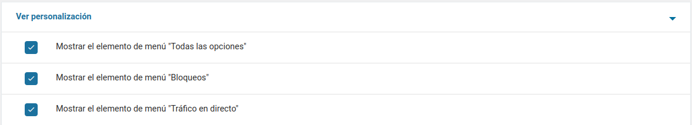

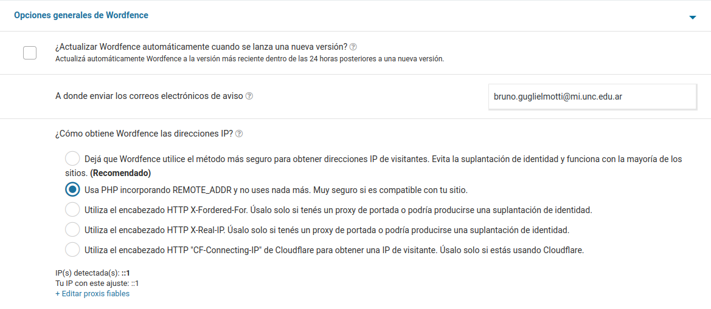

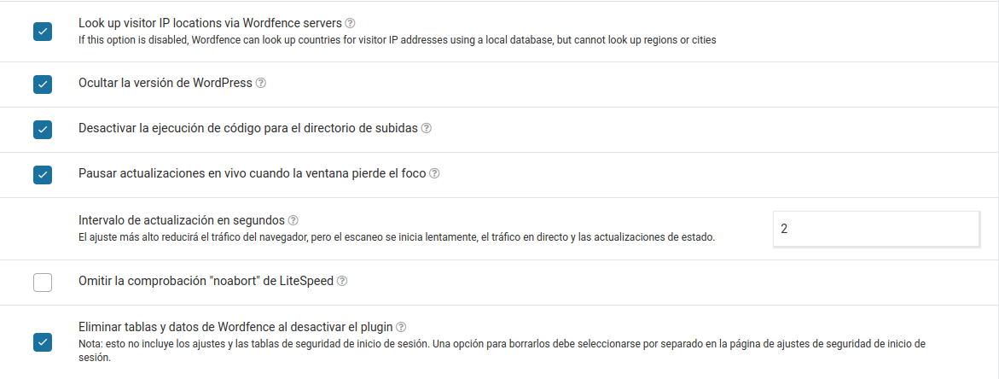


### Instalación de algunos pluggins vulnerables
